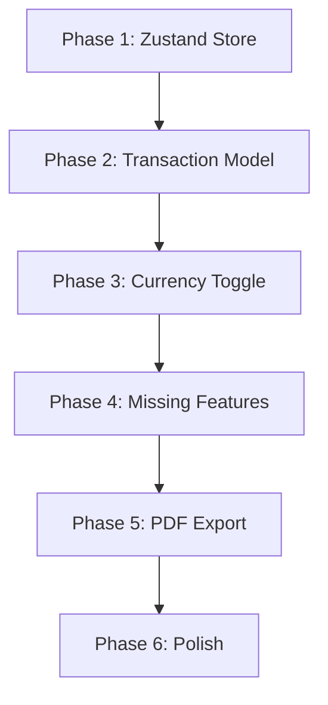

# Implementation Phases — Next.js Migration Enhancements

**Date:** February 10, 2026  
**Goal:** Bring the Next.js app to full feature parity with the legacy Python/Flask app, while keeping all current improvements (settle-up, i18n, animations, multi-currency rates).

**Reference documents:**
- [MIGRATION_REFERENCE.md](file:///c:/00%20Development/expenses-calculator-py/user-docs/reference/MIGRATION_REFERENCE.md) — Full description of the legacy Python app
- [MIGRATION_GAP_ANALYSIS.md](file:///c:/00%20Development/expenses-calculator-py/user-docs/reference/MIGRATION_GAP_ANALYSIS.md) — Gap analysis comparing current Next.js vs Python

> [!IMPORTANT]
> Each phase should be completed and verified before moving to the next. Phases are ordered by dependency — later phases depend on earlier ones.

---

## Phase 1: Global State Management (Zustand)

**Why first:** Every other phase touches state. Right now, state is scattered across `useState` in individual components (`SessionEditor`, `ParticipantsManager`, `SessionsList`) and synced through prop drilling. Centralizing state *before* changing the data model prevents cascading rewrites.

### Why Zustand (and not alternatives)

| Option | Verdict | Reasoning |
|--------|---------|-----------|
| **Zustand** | ✅ Chosen | Lightweight (~1KB), minimal boilerplate, works like the Python app's centralized `state.js` module. Built-in `persist` middleware handles IndexedDB caching automatically. No providers/wrappers needed (unlike Context). |
| React Context | ❌ Rejected | Causes unnecessary re-renders for deeply nested state. Would need multiple contexts to avoid perf issues. Not suitable for complex state with many actions. |
| Redux Toolkit | ❌ Rejected | Overkill for this app's scale. Adds ~10KB, requires provider, slice boilerplate, and action creators. Benefits (middleware, devtools) don't justify the complexity here. |
| Jotai/Recoil | ❌ Rejected | Atomic state model is a poor fit — the app's state is a single coherent tree (sessions, transactions, participants), not independent atoms. |

### What Changes

#### [NEW] `src/store/useAppStore.ts`
- Create Zustand store with `persist` middleware (using IndexedDB via the already-installed `idb` package)
- State shape:
  ```ts
  {
    // Auth (read from AuthProvider, mirrored here for convenience)
    userId: string | null;

    // Participants (global, across sessions)
    participants: string[];
    frequentParticipants: string[];

    // Active session being edited
    activeSession: {
      id?: string;           // set when editing an existing session
      name: string;
      description: string;
      transactions: Transaction[];
      participants: string[];
      mainCurrency: string;
      currencies: Record<string, number>;  // extra currencies with exchange rates
    };

    // Cached sessions list (for the sidebar/list view)
    sessions: Session[];

    // Sync metadata
    lastSyncedTimestamp: number | null;
    isSyncing: boolean;
  }
  ```
- Actions: `addTransaction`, `removeTransaction`, `updateTransaction`, `addParticipant`, `removeParticipant`, `toggleFrequentParticipant`, `loadSession`, `resetActiveSession`, `setCurrencies`, `setSessions`, `syncFromServer`, etc.
- **Important:** The `persist` middleware should use `createJSONStorage` with a custom IndexedDB adapter built on the `idb` library already in `package.json`. This replaces the current manual `localDB` implementation.

#### [MODIFY] [SessionEditor.tsx](file:///c:/00%20Development/expenses-calculator-py/src/components/expenses/SessionEditor.tsx)
- Replace all local `useState` for transactions, participants, currencies with `useAppStore` selectors
- Component becomes thinner — UI rendering + store action calls only
- **Rationale:** Currently this 652-line component manages its own state and duplicates logic that should live in the store. Zustand selectors give it reactive updates without prop drilling.

#### [MODIFY] [ParticipantsManager.tsx](file:///c:/00%20Development/expenses-calculator-py/src/components/expenses/ParticipantsManager.tsx)
- Read/write participants from store instead of local `useState`
- Frequent participant star toggle wired to store
- **Rationale:** Currently uses `useState(initialParticipants)` which means it doesn't stay in sync if participants change from another component.

#### [MODIFY] [SessionsList.tsx](file:///c:/00%20Development/expenses-calculator-py/src/components/expenses/SessionsList.tsx)
- Read sessions from store instead of local `useState(initialSessions)`
- Delete action updates store (and Firestore via server action)
- **Rationale:** Same sync issue — local state diverges from source of truth.

#### [MODIFY] [useCachedData.ts](file:///c:/00%20Development/expenses-calculator-py/src/hooks/useCachedData.ts)
- Becomes a lightweight sync hook that fetches from Firestore and pushes data into the Zustand store
- IndexedDB persistence is now handled by Zustand's persist middleware, so this hook no longer manually reads/writes IndexedDB
- **Rationale:** Eliminates the dual-source-of-truth problem (component state vs cache vs Firestore).

#### [DELETE or SIMPLIFY] `src/lib/storage/indexedDb.ts`
- Zustand persist replaces the manual `localDB.getSessions()`, `localDB.saveSessions()`, etc.
- If any non-Zustand IndexedDB use remains, keep a minimal version; otherwise delete.

### Dependencies to Install
- `zustand` — `npm install zustand`

---

## Phase 2: Transaction Model — Per-Transaction Hybrid Mode

**Goal:** Each transaction independently chooses its mode. Default = Python's simple "split among checked people." Any individual transaction can optionally specify a payer via a subtle, non-intrusive UI element.

**Why per-transaction (not per-session):** The user explicitly requested this. It's also more flexible — a single session might have some expenses where tracking who paid matters (e.g., shared Uber) and others where it doesn't (e.g., individual subscriptions). Forcing a session-wide toggle would be unnecessarily rigid.

### UX Design — Keeping It Clean

> [!IMPORTANT]
> The payer feature must be **discoverable but not in-your-face**. Users who don't need it should never feel overwhelmed by it. The default view should look identical to the Python app's simple checkbox interface.

**Default state of each transaction row (simple mode — no payer set):**
```
┌──────────────────────────────────────────────────────────────┐
│ 15/06/2024  │  Dinner at restaurant  │  USD 60.00  │  🗑️   │
│─────────────────────────────────────────────────────────────│
│ Split among: ☑ Alice  ☑ Bob  ☑ Charlie                      │
│                                        ···  Who paid? →     │
└──────────────────────────────────────────────────────────────┘
```

- The **"Who paid?"** text is a subtle muted link/button at the bottom-right of each transaction row
- Default font size: small, muted color (e.g., `text-muted-foreground text-xs`)
- Clicking it smoothly expands an inline payer dropdown:

**Expanded state (after clicking "Who paid?"):**
```
┌──────────────────────────────────────────────────────────────┐
│ 15/06/2024  │  Dinner at restaurant  │  USD 60.00  │  🗑️   │
│─────────────────────────────────────────────────────────────│
│ Split among: ☑ Alice  ☑ Bob  ☑ Charlie                      │
│ Paid by: [ Bob ▼ ]                          ✕ Remove payer  │
└──────────────────────────────────────────────────────────────┘
```

**Why this UX pattern:**
- Users who just want simple splitting (Python behavior) see only checkboxes — no extra clutter
- "Who paid?" is always available but never forced — progressive disclosure
- No toggle/switch to learn — clicking "Who paid?" is self-explanatory
- Removing the payer (`✕ Remove payer`) gracefully reverts to simple mode
- The payer dropdown auto-populates with session participants — no extra data entry
- Framer Motion `AnimatePresence` for smooth expand/collapse so it doesn't feel jarring

### What Changes

#### [MODIFY] [index.ts (types)](file:///c:/00%20Development/expenses-calculator-py/src/types/index.ts)
- Update `Transaction` interface:
  ```ts
  interface Transaction {
    description: string;
    amount: number;
    date: string;
    currency?: string;    // which session currency this tx uses

    // Always present: who shares the cost (checkbox selections)
    assigned_to: string[];

    // Optional per-transaction: who paid out of pocket
    // When undefined/empty → simple split mode (Python-style: divide among assigned_to)
    // When set → payer mode (Splitwise-style: payer gets credit, assigned_to get debits)
    payer?: string;
  }
  ```
- **Note:** We drop `splitWith` entirely. The `assigned_to` array serves both modes:
  - Simple mode: `assigned_to` = who the cost is split among
  - Payer mode: `assigned_to` = who the cost is split among (same field), `payer` = who paid
  - This unification simplifies the data model — one field for "who shares," an optional field for "who paid"

#### [MODIFY] [calculations.ts](file:///c:/00%20Development/expenses-calculator-py/src/lib/calculations.ts)
- `calculateSummary()` detects mode **per-transaction independently**:
  - **If `tx.payer` is set:**
    - Credit the payer's `totalPaid` with the full transaction amount
    - Divide the amount among `assigned_to` members and add to each person's `fairShare`
    - `balance = totalPaid - fairShare` (positive = gets money back, negative = owes)
  - **If `tx.payer` is undefined (simple mode):**
    - Divide the amount equally among `assigned_to` members
    - Add each person's share to their running total (no payer/balance concept)
  - Both modes can coexist in the same session — the math is additive
- `calculateDebts()` runs on the final balances regardless of how they were computed
- **Edge case handling:**
  - Transaction with 0 `assigned_to` → skip (don't divide by zero)
  - Transaction where `payer` is not in `assigned_to` → payer still gets credit for paying but doesn't share the cost (valid scenario: "I paid for their dinner but didn't eat")

#### [MODIFY] [SessionEditor.tsx](file:///c:/00%20Development/expenses-calculator-py/src/components/expenses/SessionEditor.tsx)
- Each transaction row gets a subtle **"Who paid?"** link (muted text, small font) below the checkboxes
- Clicking it:
  1. Expands an inline row with a `<select>` dropdown of session participants
  2. Selecting a participant sets `tx.payer` in the store
- "✕ Remove payer" link to clear `tx.payer` and collapse the row
- Default state: collapsed (clean, simple-mode visual — identical to Python app)
- Smooth expand/collapse animation via framer-motion `AnimatePresence`
- All other existing UI stays the same: checkboxes for `assigned_to`, amount field, date, description

#### [MODIFY] [SettleUp.tsx](file:///c:/00%20Development/expenses-calculator-py/src/components/expenses/SettleUp.tsx)
- Show debt settlement section ("who pays whom") whenever **any** transaction in the session has a `payer` set
- If **zero** transactions have payers → show only the simple per-person totals summary (like Python)
- Mixed sessions (some with payer, some without) → show both the totals summary and the settle-up debts
- **Rationale:** The settle-up component is only meaningful when payer data exists. Showing it when all transactions are simple-mode would just say "everyone is even" which is noise.

#### [MODIFY] [service.ts](file:///c:/00%20Development/expenses-calculator-py/src/lib/firebase/service.ts) → `normalizeTransaction()`
- Update to handle three legacy formats seamlessly:
  1. **Old Python format:** `{ assigned_to: [...], amount, description, date }` → map to new format with no `payer`
  2. **Current Next.js format:** `{ payer, splitWith: [...] }` → map `splitWith` to `assigned_to`, keep `payer`
  3. **New format:** `{ assigned_to: [...], payer? }` → use as-is

---

## Phase 3: Currency System — Toggle + Multi-Currency

**Goal:** Keep the current multi-currency exchange rate system (which is an improvement over Python's simple primary/secondary pair), but bring back the per-transaction currency toggle that was in the Python app.

**Why keep multi-currency rates:** The Python app only had primary/secondary with no actual conversion math — the toggle just changed the label. The current Next.js app already has real exchange rate conversion. We want to keep that AND make it easy to toggle per-transaction.

### What Changes

#### [MODIFY] [index.ts (types)](file:///c:/00%20Development/expenses-calculator-py/src/types/index.ts)
- Ensure `Transaction.currency` is properly typed as `string | undefined` and defaults to session's `mainCurrency` when undefined

#### [MODIFY] [SessionEditor.tsx](file:///c:/00%20Development/expenses-calculator-py/src/components/expenses/SessionEditor.tsx)
- **Per-transaction currency toggle**: Clickable pill/badge next to the amount showing the currency code
  - Visual: small rounded badge (e.g., `USD` in a pill with subtle background)
  - Click behavior: cycles through session's available currencies (main + all extras)
  - Example: `USD` → click → `EUR` → click → `COP` → click → back to `USD`
  - Updates `transaction.currency` in the store
  - Smooth text transition animation
  - **Why a toggle badge (not a dropdown):** Faster for the common case (2-3 currencies). A dropdown requires click-open-select-close (4 actions). A toggle badge is click-done (1 action). For sessions with many currencies (4+), we can fall back to a small dropdown.
- **Currency management section** (already partially exists, enhance):
  - Main currency dropdown — already works
  - "Add currency" with exchange rate input — already works
  - Remove extra currencies — already works
  - **Add PEN** (Peruvian Sol) to `CURRENCY_OPTIONS` array — currently missing, was the default in Python

#### [MODIFY] [calculations.ts](file:///c:/00%20Development/expenses-calculator-py/src/lib/calculations.ts)
- When calculating summaries, convert each transaction's amount to main currency using session exchange rates
- This is already partially implemented — verify it works correctly and handles edge cases:
  - Transaction with `currency === mainCurrency` → no conversion needed
  - Transaction with `currency === undefined` → treat as mainCurrency
  - Transaction with currency not in rates map → log warning, use raw amount

#### [MODIFY] [SettleUp.tsx](file:///c:/00%20Development/expenses-calculator-py/src/components/expenses/SettleUp.tsx)
- Display all amounts normalized to main currency
- Show currency code alongside amounts (already does this)

---

## Phase 4: Missing Features — Feature Parity with Python

**Goal:** Bring back all Python app features that are currently missing. These are the "table stakes" features that users of the Python app would expect.

### 4A. Bulk Transaction Paste

**What Python had:** A `<textarea>` where users paste multi-line text in `DD/MM/YYYY: Description - Amount` format. One click parses all lines into transactions.

**Current state:** `parser.ts` exists and works correctly, but the UI uses `prompt()` (browser prompt dialog) instead of an inline textarea. This is a bad UX.

#### [MODIFY] [SessionEditor.tsx](file:///c:/00%20Development/expenses-calculator-py/src/components/expenses/SessionEditor.tsx)
- Replace `prompt()` with a collapsible "Bulk Import" section:
  - A toggle button ("Import from text" or similar) that expands a section with:
    - `<textarea>` with placeholder text showing the expected format
    - Format hint below: `DD/MM/YYYY: Description - Amount`
    - "Import" button that calls `parseTransactions()` from `parser.ts`
    - Error feedback: if some lines fail to parse, show which ones and why
    - Success: close the section, show toast "X transactions imported"
  - Collapsed by default to keep the UI clean

### 4B. Transaction Search & Filter

**What Python had:** Real-time search box that filters the transaction table by date, description, or amount as you type. Pure DOM visibility toggle — doesn't affect state or calculations.

#### [MODIFY] [SessionEditor.tsx](file:///c:/00%20Development/expenses-calculator-py/src/components/expenses/SessionEditor.tsx)
- Add a search `<input>` above the transaction list
- Filter is **visual only** — hides non-matching transaction cards/rows via CSS or conditional rendering
- Does NOT modify the transactions array in the store (filtering is ephemeral)
- Case-insensitive partial matching across date + description + amount text
- "✕" clear button to reset filter
- Debounced (150ms) to avoid excessive re-renders on fast typing
- **Why visual-only:** Calculations must always use all transactions, not just visible ones. This matches the Python behavior.

### 4C. Frequent Participants + Autocomplete

**What Python had:** A star (☆/★) icon on each participant card. Starred participants appear as autocomplete suggestions when adding new participants. Synced to Firestore.

#### [MODIFY] `src/store/useAppStore.ts`
- Add `toggleFrequentParticipant(name: string)` action
- Stores in `frequentParticipants: string[]` array
- Syncs to Firestore `users/{userId}/frequentParticipants` field

#### [MODIFY] [ParticipantsManager.tsx](file:///c:/00%20Development/expenses-calculator-py/src/components/expenses/ParticipantsManager.tsx)
- Add a star icon button (☆/★) on each participant card, toggles on click
- The input for adding participants gets a `<datalist>` populated from `frequentParticipants`
- **Why `<datalist>` (not a custom autocomplete):** Native browser support, accessible, zero dependencies. Good enough for a short list of names.

### 4D. Confirmation Dialogs

**What Python had:** `window.confirm()` dialogs before destructive actions.

**Our approach:** A reusable animated modal component instead of bare `confirm()`. Better UX, consistent with the app's design language, allows custom messaging.

#### [NEW] `src/components/ui/confirm-dialog.tsx`
- Reusable confirmation dialog component
- Props: `title`, `message`, `confirmLabel`, `cancelLabel`, `variant` (danger/warning/info), `onConfirm`, `onCancel`
- Backdrop with blur, framer-motion enter/exit
- Keyboard accessible (Escape to cancel, Enter to confirm)
- **Why a custom component (not `window.confirm()`):** Styleable, async-friendly, doesn't block the JS thread, matches the app's visual design. Python used `confirm()` because it was vanilla JS — in React, a modal component is the standard.

#### [MODIFY] Various components — add confirmation before:
- **Delete participant**: "Remove [name]? Their assignments will be cleared."
- **Delete transaction**: "Delete [date] - [description]?"
- **Delete all transactions**: "Clear all X transactions? This cannot be undone."
- **Load session**: "Loading [session name] will replace your current unsaved work. Continue?"
- **New session**: "Start a new session? Any unsaved changes will be lost."
- **Delete session**: "Permanently delete [session name]? This cannot be undone."

### 4E. New Session / Reset

**What Python had:** "New Session" button in the header. Clears all transactions, resets participants to frequent-only, resets currencies to defaults. Confirmation dialog first.

#### [MODIFY] [page.tsx](file:///c:/00%20Development/expenses-calculator-py/src/app/page.tsx)
- Add "New Session" button (visible when the editor is open or transactions exist)
- Uses confirm dialog: "Start a new session? Unsaved changes will be lost."
- Calls `resetActiveSession()` on the Zustand store, which:
  - Clears all transactions
  - Sets participants to frequent participants list
  - Resets currencies to defaults (main: USD, no extras)
  - Clears session name/description
  - Clears session ID (so saving creates a new session, not an overwrite)

### 4F. Session Overwrite

**What Python had:** "Save" button on each session row that overwrites the existing session with current active data.

#### [MODIFY] [SessionsList.tsx](file:///c:/00%20Development/expenses-calculator-py/src/components/expenses/SessionsList.tsx)
- Add an "Update" or "Overwrite" button/icon on session cards
- Only visible/enabled when there's an active session being edited
- Uses confirm dialog: `Overwrite "[session name]" with current data?`
- Calls `firestoreService.updateSession()` with current active session data
- Updates store and shows success toast

---

## Phase 5: PDF Export — Premium Design

**Goal:** Client-side PDF generation with a stunning, professional layout. This was a core feature of the Python app (using jsPDF + jspdf-autotable) and is completely absent in Next.js.

**Good news:** Both `jspdf` (v4.1.0) and `jspdf-autotable` (v5.0.2) are **already in `package.json`** and installed. We just need to write the generation logic and wire up the UI.

### What Changes

#### [NEW] `src/lib/pdfExport.ts`
- Core function: `exportSessionPdf(session: Session, summaries, debts, options)`
- Uses `jspdf` for document creation, `jspdf-autotable` for tables

**PDF Layout Design (detailed):**

**Header section (top of first page):**
- A thin colored accent bar across the top (5px, gradient from primary color)
- App name "ExpenseSplit Pro" in small caps, muted
- Session name as the main title (large, bold, dark navy)
- Export date/time right-aligned
- Currency information: "Main currency: USD | Exchange rates: EUR (0.92), COP (4200)"
- A thin separator line

**Transactions Table:**
- Column headers: #, Date, Description, Amount, Currency, Assigned To
- Alternating row shading (very subtle gray, e.g., `#f8f9fa` and white)
- Right-aligned amounts with consistent decimal formatting
- "Assigned To" column: comma-separated names, wraps if long
- If transaction has a payer: show "Paid by: Bob" in italics below the amount
- Table header: dark navy background with white text
- Page breaks handled gracefully by jspdf-autotable

**Summary Table:**
- Title: "Expense Summary"
- Columns: Participant, Total Spent (simple mode) OR Total Paid / Fair Share / Balance (payer mode)
- Grand total row: bold, slightly different background
- Color indicators for balance: green text for positive (gets back), red for negative (owes)

**Settle-Up Section (only if any transaction has a payer):**
- Title: "Settlement Suggestions"
- Clean list: "Charlie pays $30.00 → Alice"
- Arrow character or text-based flow

**Footer (every page):**
- Left: "Generated by ExpenseSplit Pro"
- Center: Date
- Right: "Page X of Y"

#### [MODIFY] [SessionsList.tsx](file:///c:/00%20Development/expenses-calculator-py/src/components/expenses/SessionsList.tsx)
- Add "Export PDF" button (download/file icon) on each session card
- On click: calculates summaries and debts for that session, then calls `exportSessionPdf()`
- Brief loading state while PDF generates

#### [MODIFY] [SessionEditor.tsx](file:///c:/00%20Development/expenses-calculator-py/src/components/expenses/SessionEditor.tsx)
- Add "Export" button in the editor's top toolbar
- Exports the current active session as PDF

### Design Principles
- **No color overload** — Restrained palette: dark navy (`#1a1f36`) for headers, soft grays for body, one accent color (the app's primary)
- **Professional typography** — Helvetica (built into jsPDF), proper hierarchy (16pt title, 11pt body, 9pt footnotes)
- **Generous whitespace** — Minimum 15mm margins, breathing room between sections
- **Print-optimized** — Designed to look great on both screen (PDF viewer) and paper (printed)
- **Right-aligned numbers** — All monetary amounts right-aligned with consistent 2-decimal formatting and currency symbols
- **Sensible page breaks** — Tables don't split mid-row across pages

---

## Phase 6: Polish & Final Verification

### 6A. Toast Notifications

**Why:** The Python app showed feedback via `alert()` and DOM status messages. The Next.js app currently has no user feedback for most actions — you click "save" and nothing visually confirms it worked.

#### [NEW] `src/components/ui/toast.tsx`
- Lightweight toast/snackbar component (no heavy dependencies like react-hot-toast — we can build a simple one with framer-motion which is already installed)
- Variants: success (green), error (red), info (blue)
- Auto-dismiss after 3-4 seconds
- Position: bottom-right (non-intrusive, doesn't block main content)
- Animated entry (slide up + fade in) and exit (slide down + fade out)
- **Why custom (not a library):** The toast is ~50 lines of code with framer-motion. Adding `react-hot-toast` or `sonner` is an unnecessary dependency for such a simple feature.

#### [MODIFY] Various components — add toast feedback for:
- "Session saved ✓"
- "Session updated ✓"
- "Session deleted"
- "Participant added"
- "Participant removed"
- "Transaction deleted"
- "X transactions imported"
- "PDF downloaded ✓"
- Error messages on any failed Firestore operation

### 6B. Missing UI Polish
- **Grand total row** in the SettleUp/summary component — bold bottom row summing all participant totals
- **Delete all transactions** button in SessionEditor — with confirmation dialog
- **Unassign all** button per transaction (small "clear all" link to uncheck all checkboxes)
- **Participant count badge** — already exists, verify it updates in real-time with Zustand
- **Loading states** — spinners or skeleton UI for save/delete/sync operations

### 6C. PEN Currency
- Add `"PEN"` (Peruvian Sol) to `CURRENCY_OPTIONS` array in `SessionEditor.tsx`
- This was the default currency in the Python app and is currently missing

---

## Verification Plan

### Automated (Build Check)
```bash
npm run build
```
- Must compile without TypeScript errors
- Must complete without build warnings related to our changes
- Run after every phase before moving to the next

### Manual Testing Checklist

> [!NOTE]
> All manual tests should be performed in the browser at `http://localhost:3000` after running `npm run dev`. The user will verify these manually.

#### Phase 1 — State Management
1. Sign in with Google → data loads from Firestore
2. Add a participant → refresh the page → participant still there (IndexedDB persistence)
3. Add transactions in SessionEditor → refresh the page → transactions still there
4. Open browser DevTools → Application → IndexedDB → verify Zustand store data is saved
5. Sign out → sign back in → data re-syncs correctly from Firestore
6. Verify no console errors during normal operation

#### Phase 2 — Transaction Model
1. **Simple mode (default)**: Add a transaction → see participant checkboxes → check 3 people → summary shows amount ÷ 3 per person (Python-style behavior)
2. Click "Who paid?" on any transaction → payer dropdown appears with smooth animation
3. Select a payer → SettleUp component now shows the "Suggested Payments" section
4. Click "✕ Remove payer" → payer dropdown collapses, reverts to simple mode
5. **Mixed mode**: Set payer on some transactions but not others → summary handles both correctly
6. Save session → reload → payer selections preserved in Firestore

#### Phase 3 — Currency
1. Set main currency to USD → add EUR with rate 0.92 → add COP with rate 4200
2. Add a transaction → click the currency badge → cycles through USD → EUR → COP → USD
3. Add transactions in different currencies → summary shows all totals normalized to USD
4. Change main currency to EUR → summary recalculates (USD transactions converted via rate)
5. Remove a currency → transactions using it get reset to main currency (or show a warning)

#### Phase 4 — Missing Features
1. Click "Import from text" → textarea appears → paste 3 lines → click Import → 3 transactions added
2. Type in the search box → only matching transactions are visible → clear search → all visible again
3. Star ☆ a participant → add a new participant → see the starred name in autocomplete suggestions
4. Click delete on a participant → confirmation dialog appears → cancel → nothing happens → confirm → removed
5. Click "New Session" → confirmation dialog → confirm → everything resets
6. Click "Load" on a session → confirmation about losing unsaved work → confirm → session loads

#### Phase 5 — PDF
1. Save a session with 5+ transactions, 3+ participants, mixed currencies
2. Click "Export PDF" on the session card → PDF downloads
3. Open PDF and verify:
   - Header has session name, date, currency info
   - Transaction table is clean, amounts right-aligned, currency symbols correct
   - Summary table shows per-participant totals
   - If payer mode used: settle-up section shows payment flows
   - Footer shows "ExpenseSplit Pro" and page numbers
4. Print the PDF → verify it looks professional on paper (no cut-off text, clean margins)

#### Phase 6 — Polish
1. Save a session → toast appears "Session saved ✓" → auto-dismisses after 3-4 seconds
2. Delete a transaction → toast appears
3. Verify grand total row in summary
4. Toggle dark mode → all new components (toasts, confirm dialog, payer dropdown) render correctly in both themes

---

## Dependency Order



**Why this order:**
- **Phase 1 → 2:** Can't change the transaction model without a centralized store to hold it
- **Phase 2 → 3:** Currency toggle per-transaction needs the `Transaction.currency` field finalized
- **Phase 3 → 4:** Missing features (search, filter, bulk paste) need the final data model
- **Phase 4 → 5:** PDF export needs to render the final UI data (both split modes, all currencies)
- **Phase 5 → 6:** Polish happens last because toasts/dialogs span all features

---

## Estimated Scope
| Phase | Files Modified | Files Created | Complexity | Justification |
|-------|---------------|---------------|------------|---------------|
| 1. Zustand | 5 | 1 | Medium | Mostly wiring — replacing `useState` with store selectors |
| 2. Transaction Model | 5 | 0 | High | Core data model change + calculation logic + UI for payer |
| 3. Currency Toggle | 3 | 0 | Medium | UI widget + minor calculation verification |
| 4. Missing Features | 5 | 2 | Medium-High | Multiple small features, one new component (confirm dialog) |
| 5. PDF Export | 3 | 1 | High | Complex layout logic, needs careful formatting |
| 6. Polish | 4 | 1 | Low-Medium | Toast component + sprinkling feedback throughout |
| **Total** | **~13 unique files** | **5 new files** | | |
